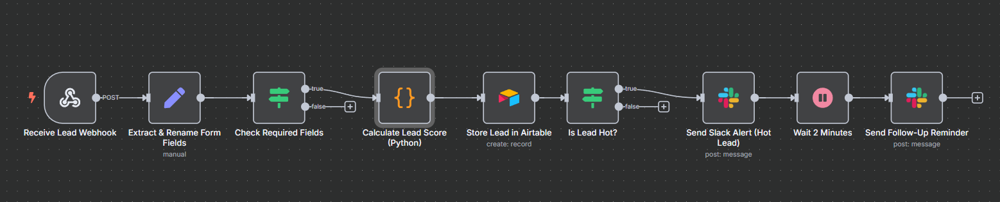

# 🔥 Lead Qualification Workflow (n8n + Airtable + Slack)



This project is a smart lead automation system built with [n8n](https://n8n.io), Airtable, and Slack — all using **free-tier tools**. It processes leads submitted via form, scores them based on defined logic, stores them in Airtable, and sends Slack alerts for high-value opportunities.

## 💡 Features

- Webhook trigger to receive lead submissions
- Validation for required fields
- Scoring logic using Python (budget, interest, company size)
- Categorization into Cold / Warm / Hot leads
- Airtable integration for structured lead storage
- Real-time Slack notifications for hot leads
- Delayed follow-up message to simulate lead nurturing

## ⚙️ Tech Stack

- [n8n](https://n8n.io): Workflow automation
- [Airtable](https://airtable.com): Lead database
- [Slack](https://slack.com): Sales team notifications
- [Tally.so](https://tally.so) or custom form: Lead input

## 🧠 Scoring Logic

```latex
\text{Score} = (\text{Interest} \times 0.5 + \text{Budget} \times 0.3 + \text{Company Size} \times 0.2) \times 100
```

* **Hot Lead**: Score ≥ 70
* **Warm Lead**: 40 ≤ Score < 70
* **Cold Lead**: Score < 40

## 📸 Screenshots

* ✅ Full n8n workflow diagram
* 📊 Airtable lead record example
* 💬 Slack notification + follow-up message

(Screenshots available in the documentation.)

## 📄 Documentation

Includes a short walkthrough:

* Visual workflow diagram
* Node descriptions
* Lead scoring breakdown
* Assumptions & limitations
* Improvement ideas

## 🚀 Getting Started

1. Import the `.json` into your n8n instance
2. Set up Airtable and Slack credentials
3. Trigger the workflow via form or manual test

---

Made for anyone building smarter lead pipelines with automation ✨
